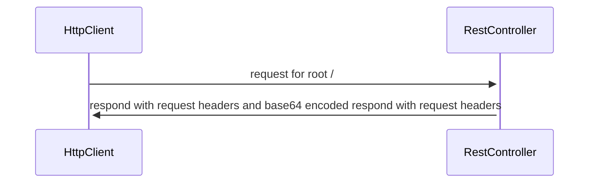
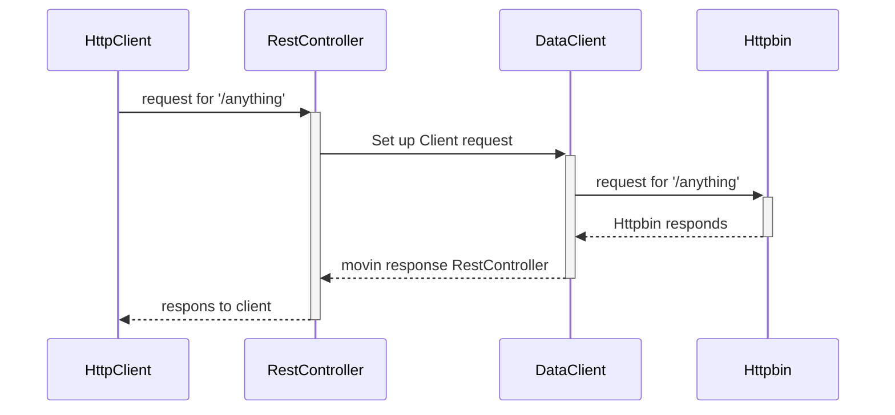

# WebServish
A simple Webb/REST project

## Two simple flows
### request / response
HttpClient --> Controller[/]

### request / response with a simple proxy
HttpClient --> Controller[/anything] --> DataClient --> [http://httpbin.org/anything]

